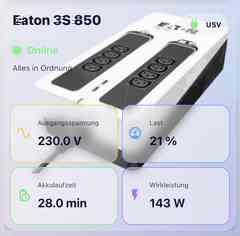

<p align="center">
  
</p>

<h1 align="center">Eaton UPS Card</h1>

<p align="center">
  Responsive Home-Assistant-Dashboard-Card für eine Eaton 3S 850 USV.
</p>

<p align="center">
  <strong>Version 1.0.0</strong><br>
  <a href="https://github.com/BeGiBue/eaton-ups-card/actions/workflows/validate.yml"></a>
</p>

## Vorschau



## Funktionen

- Theme-sensitive Darstellung für Light Mode, Dark Mode und benutzerdefinierte Themes
- Eingebettetes Eaton-3S-850-Produktbild – keine zusätzliche Bilddatei in Home Assistant erforderlich
- Native Home-Assistant-Entity-Picker im grafischen Karteneditor
- Automatische Auswertung typischer NUT-Statuswerte
- Klick auf Messwerte öffnet den Home-Assistant-Mehr-Informationen-Dialog

## Standard-Entitäten

```text
sensor.ups_ausgangsspannung
sensor.ups_last
sensor.ups_status
sensor.ups_statusdaten
sensor.ups_akkulaufzeit
sensor.waschkeller_ups_wirkleistung
```

Alle Entitäten können im grafischen Karteneditor über die normalen Home-Assistant-Entity-Picker oder per YAML geändert werden.

## Installation über HACS

### Automatisch

[](https://my.home-assistant.io/redirect/hacs_repository/?owner=BeGiBue&repository=eaton-ups-card&category=plugin)

### Manuell

1. In HACS **Benutzerdefinierte Repositories** öffnen.
2. `https://github.com/BeGiBue/eaton-ups-card` hinzufügen.
3. Als Typ **Dashboard** auswählen.
4. **Eaton UPS Card** installieren.
5. Home Assistant bzw. den Browser vollständig neu laden.

Das Repository enthält eine HACS-Validierung unter `.github/workflows/validate.yml`. In `hacs.json` ist `eaton-ups-card.js` explizit als Plugin-Datei angegeben.

## Card hinzufügen

Minimal:

```yaml
type: custom:eaton-ups-card
```

Vollständiges Beispiel:

```yaml
type: custom:eaton-ups-card
name: Eaton 3S 850
status_entity: sensor.ups_status
status_data_entity: sensor.ups_statusdaten
voltage_entity: sensor.ups_ausgangsspannung
load_entity: sensor.ups_last
runtime_entity: sensor.ups_akkulaufzeit
power_entity: sensor.waschkeller_ups_wirkleistung
show_status_data: true
```

## Bild

Das Standardbild der Eaton 3S 850 ist direkt in `eaton-ups-card.js` eingebettet. HACS muss deshalb keine zusätzliche Bilddatei installieren.

Optional kann eine eigene Bild-URL gesetzt werden:

```yaml
image: /local/images/meine_usv.png
```

Kann die eigene Bild-URL nicht geladen werden, fällt die Card auf das eingebettete Standardbild zurück.

## Layout

Die Card verwendet ein festes 2×2-Raster für die vier Messwerte:

```text
┌──────────────────────────────────────┐
│ Eaton 3S 850              [ USV ]    │
│ ● Online                    BILD     │
│ Alles in Ordnung                     │
├──────────────────┬───────────────────┤
│ Ausgangsspannung │ Last              │
├──────────────────┼───────────────────┤
│ Akkulaufzeit     │ Wirkleistung      │
└──────────────────┴───────────────────┘
```

Breite und Höhe werden über Home Assistants **Layout**-Einstellungen festgelegt. Die Card implementiert `getGridOptions()` und bleibt innerhalb des zugewiesenen Layout-Slots.

## Statusauswertung

Typische NUT-Statuswerte werden automatisch interpretiert:

- `OL` / `ONLINE` → Online / Alles in Ordnung
- `OL CHRG` / `CHARG` → Netzbetrieb / Akku wird geladen
- `OB` / `ON BATTERY` → Batteriebetrieb
- `LB` / `LOW` → Akku niedrig
- `BYPASS` → Bypass
- `OVER` → Überlast
- `FAULT` / `FSD` → Störung
- `OFF` → Ausgeschaltet

Für die Statusauswertung werden `status_entity` und `status_data_entity` gemeinsam berücksichtigt.

## Release

Release Notes für Version 1.0.0: [`RELEASE_NOTES_1.0.0.md`](RELEASE_NOTES_1.0.0.md)

## Hinweise zu Marken

Dieses Projekt ist ein unabhängiges Community-Projekt und steht in keiner Verbindung zu Eaton oder Home Assistant. Es wird weder von Eaton noch von Home Assistant unterstützt oder herausgegeben.

**Eaton** und **Eaton 3S** sind Marken ihrer jeweiligen Rechteinhaber. Das im Repository verwendete Projektlogo ist ein eigenständiges Community-Projektlogo und nicht das offizielle Eaton-Unternehmenslogo.

## Lizenz

GNU Affero General Public License v3.0 (**AGPL-3.0**).

Details stehen in [`LICENSE`](LICENSE).
